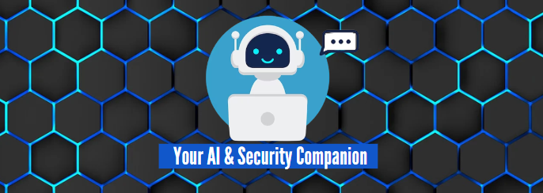
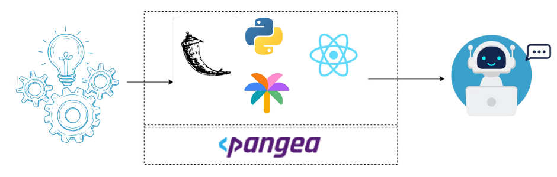

# pBot
Building On Pangea Made Easier

## pBot: Enhancing Cybersecurity through Intelligent Automation

## Motivation and Research

The genesis of pBot can be traced back to the obstacles encountered while integrating APIs and SDKs into the mPoint Hub, a cybersecurity hub based in Uganda. Amidst trials with bots like ChatGPT, Bard, and Bing, only Bard provided information, albeit with prompt modifications.

## pBot Components

pBot, a chatbot leveraging Google Bard Palm API, is structured into three key components and folders. 

-  The "Base" is a React app handling authentication and UI based on repository examples. 
- "Intel" comprises three Python Flask APIs—User Intel, Domain Intel, and IP Intel.  
- The third component is pBot itself, constructed on Google Palm API 2 via Python Flask, enriched with a Pangea context for personalized outputs.

## pBot Architecture

## Contributions
See Contribsutions file

## Next Steps

pBot's evolution hinges on continuous improvement, aiming to maximize capabilities and train it with custom Pangea data. This open-source project welcomes contributions and operates under the MIT license.

## Useful URLS

- [Read More](#)  
- [Visit pBot](https://pangeabot.surge.sh/)  
- [Video Demo](#)
